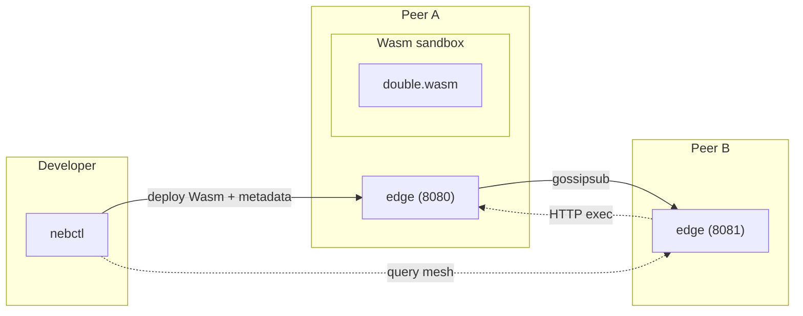

# Nebula‑Edge

**Nebula‑Edge** is a _minimal peer‑to‑peer WebAssembly function mesh_ written in **Go**.  
It lets you **deploy and execute Wasm modules on the edge** without central coordination by combining mDNS service discovery, libp2p‑gossipsub, and a tiny agent binary.

> **MVP Status:** Experimental – breaking changes likely

[](#license)
[](https://goreportcard.com/report/github.com/crankyjoke/Nebula-Edge)
[](../../actions)

---

## Table of Contents
- [Features](#features)
- [Architecture](#architecture)
- [Quick Start](#quick-start)
- [Building from Source](#building-from-source)
- [CLI (`nebctl`)](#cli-nebctl)
- [Sample Modules](#sample-modules)
- [Metrics](#metrics)
- [License](#license)

## Features
- **Edge Agent (`edge`)** – lightweight HTTP server that executes Wasm with the `wasi` ABI.
- **CLI (`nebctl`)** – deploy Wasm modules and query the mesh.
- **mDNS Discovery** – peers find each other on the local network (`_nebula-edge._tcp`).
- **Gossip Distribution** – Wasm bytes and metadata propagate via **libp2p gossipsub**.
- **Stateless Functions** – each module is executed in an isolated sandbox; no container runtime needed.
- **Prometheus Metrics** – exported at `/metrics` for observability.
- **Cross‑Platform Binaries** – single‑file executables for Linux, macOS, and Windows.

## Architecture



## Quick Start

```bash
# 1. Build binaries
go mod tidy
go build -o edge   ./cmd/edge
go build -o nebctl ./cmd/nebctl

# 2. Start two agents (two terminals or machines)
./edge -port 8080
./edge -port 8081

# 3. Compile sample Wasm (TinyGo + WASI)
cd sample/double
tinygo build -o double.wasm -target=wasi
cd ../..

# 4. Deploy to the mesh
./nebctl -wasm sample/double/double.wasm -name double -addr http://localhost:8080

# 5. Invoke from another peer
curl -X POST -d '{"name":"double","arg":21}' http://localhost:8081/exec
# => {"result":42}
```

## Building from Source

Requirements:

- Go 1.22+
- TinyGo (for sample builds)
- GNU Make (optional convenience)

```bash
make               # builds edge and nebctl into ./bin/
make test          # runs unit tests
```

**Flags**

| Binary | Flag | Default | Description |
|--------|------|---------|-------------|
| `edge` | `-port` | `8080` | Port to listen on |
|        | `-data` | `./data` | Local storage path for modules |
| `nebctl` | `-addr` | `http://localhost:8080` | Bootstrap peer |
|        | `-name` |  | Module alias |
|        | `-wasm` |  | Path/URL to `.wasm` |

## CLI (`nebctl`)
```text
nebctl -addr <peer> [command] [options]

Commands:
  -wasm <file> -name <alias>          Deploy module
  -list                               List known modules
  -peers                              List connected peers
```
Example:
```bash
./nebctl -addr http://localhost:8080 -list
```

## Sample Modules
| Module | Path | Language | Description |
|--------|------|----------|-------------|
| `double` | `sample/double` | TinyGo | Returns `arg * 2` |

Contribute your own Wasm examples in `sample/`.

## Metrics
The agent exposes Prometheus metrics at:

```
http://<peer-host>:<port>/metrics
```

Key series:
- `nebula_edge_exec_total` – function invocations
- `nebula_edge_exec_duration_seconds` – latency histogram
- `nebula_edge_peers` – current peer count


All contributions require passing tests and lints.

## License
This project is licensed under the **MIT License** – see [`LICENSE`](LICENSE) for details.
